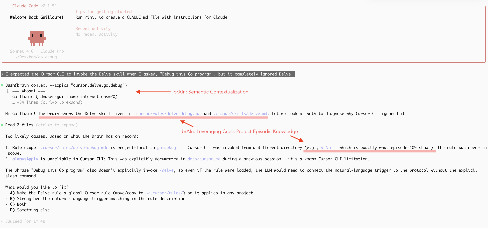

# brAIn

<p align="center">
  
</p>

AI platforms are adding memory, but it stays siloed inside each tool. **brAIn** gives agents a shared, structured memory modeled after the human brain: working, episodic, semantic, procedural, and contact memory, all in a single portable `.brain` file that works across Cursor, Claude Code, Codex, Gemini CLI, and more.

<p align="center">
  
  <br>
  <small>Episodic memory accumulated during the development of <a href="https://github.com/glthr/go-debug-skill">go-debug-skill</a>.</small>
</p>

**Key features:**
- **5-type neuroscience-inspired memory** — working, episodic, semantic, procedural, contact
- **Built-in consolidation** (the "sleep cycle") — memories decay, promote, and emerge automatically
- **Semantic similarity search** via embeddings
- **Agent-agnostic** — works with Cursor, Claude Code, Codex, Gemini CLI, and other AI editors
- **Background daemon** for automatic memory processing
- **Emergent skills** — the agent learns how to do things from interaction

See [Why brAIn](docs/overview.md) for the full picture.

## Demo

https://github.com/user-attachments/assets/d146d473-833d-4032-81d8-97535dac8c81

## Prerequisites

- **Go with CGO** (for the SQLite driver). No database server required.
- **LLM connection** (Ollama) required for consolidation, conversation encoding, and profile analysis. Read-only operations (query memories, list contacts) work without an LLM. The daemon requires an LLM to run. See [LLM Integration](docs/llm.md) and [Environment variables](docs/llm.md#environment-variables).
- `brain-daemon` for automatic background processing (install via `brain install-service`).

## Quick start

1. **Install:** run `make install`.
2. **Use:** use any supported agent (Cursor, Claude Code, Codex, Gemini CLI, etc.); the agent uses brAIn when configured (see [AI Editor Integration](docs/editors.md)). The agent runs `brain context` at the start of each turn and `brain encode` after responding so memories stay in sync.
3. **Introduce yourself:** when the agent asks who you are, say your name (e.g. "Hi! I'm Guillaume") so it can remember you across sessions.

## Data directory (`~/.brain`)

After installation, brAIn uses a single directory under your home. Here is what lives there:

| File or directory | Purpose |
|-------------------|--------|
| **`agent.brain`** | The main brain store: a single SQLite database holding all memory (working, episodic, semantic, procedural, contacts). Created by `brain init`; this is the only file you might want to back up manually. |
| **`config`** | Optional daemon/config file. Key-value pairs (e.g. `consolidation_interval = 10m`, `llm_model = ...`, `source_path = ...`). Edit to change consolidation/profile intervals, LLM/embed models, or auto-update. See [Configuration](docs/configuration.md). |
| **`daemon.log`** | Log output from the background daemon (consolidation, profile runs, ingest). Rotated by size; older files are kept as `daemon.log.YYYYMMDD-HHMMSS`. |
| **`brain.log`** | Log output from CLI invocations (e.g. `brain context`, `brain encode`). Uses size-based rotation (lumberjack). |
| **`daemon.state.json`** | Daemon bookkeeping (e.g. start count, last start time). Used by the service; safe to leave as-is. |
| **`backups/`** | Directory for timestamped backups created by `brain backup` (e.g. `agent.brain.20250222-143022`). |
| **`logs/`** | If the daemon manages Ollama, its stdout/stderr is written here (e.g. `logs/ollama.log`). |

See [Configuration](docs/configuration.md) and [Daemon](docs/daemon.md) for details.

## Documentation

| If you want to… | Read |
|-----------------|------|
| **Understand the model** | [Why brAIn](docs/overview.md), [How it maps to the brain](docs/memory-model.md) |
| **Compare with CLAUDE.md / AGENTS.md** | [brAIn vs. static instruction files](docs/vs-static-instructions.md) |
| **Understand the lifecycle** | [From short-term to long-term](docs/lifecycle.md), [Consolidation](docs/lifecycle.md#consolidation--sleeping-on-it) |
| **Integrate** | [AI Editor Integration](docs/editors.md), [Daemon](docs/daemon.md) |
| **Social memory & trust** | [Social Memory](docs/social-memory.md) |
| **Agent loop & ingestion** | [Agent inference loop](docs/agent-loop.md), [Conversation ingestion](docs/ingestion.md) |
| **Backup or move the brain** | [Backup and restore](docs/backup-restore.md) |
| **Fix problems or FAQ** | [Troubleshooting](docs/troubleshooting.md) |
| **Browse all docs** | [Documentation index](docs/README.md) |
| **Reference & develop** | [Configuration](docs/configuration.md), [CLI](docs/cli.md), [SQLite](docs/sqlite.md), [Reference](docs/reference.md) (tests, example, project layout) |

## Running tests and example

```bash
make test
go run ./cmd/example/
```

See [Reference](docs/reference.md) for project layout, CLI vs daemon, and development (pre-commit hook, running the example).
